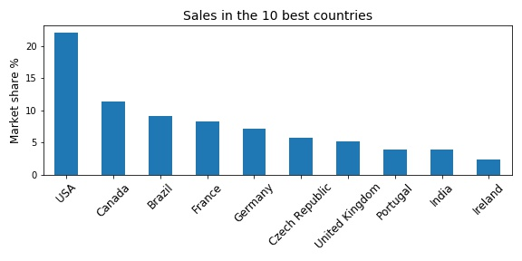
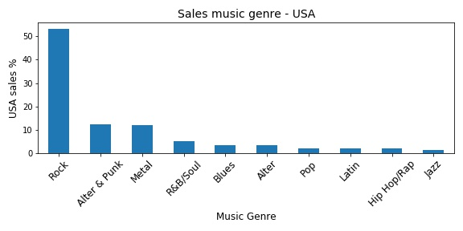

# Chinook project
or how to answer business questions using SQL ?
adivsing a fictif music store based on data retrieved from a SQL database. 

## Overview of the market
More than 20% of the business of the music store is done is USA

## USA market
The music genre Rock represents more than half of the USA market followed by Alternative/Punk and Metal. 

18% of all the sales contained at least one full album.

